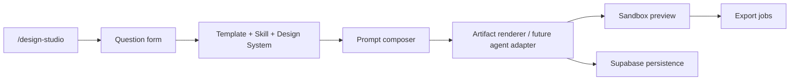

# open-design to idol-platform v5

## open-design Concepts

| open-design module | Core idea | idol-platform v5 mapping |
| --- | --- | --- |
| `skills/` | File-based design capabilities using `SKILL.md` | `skills/idol-profile`, `idol-event-page`, `idol-virtual-exhibition`, `idol-market-report`, `idol-pitch-deck` |
| `design-systems/` | Portable `DESIGN.md` systems | `design-systems/idol-platform/DESIGN.md` |
| daemon / agent adapter | Local CLI agent orchestrates generation | Future `/api/design/generate` can call Codex/Claude adapter; v1 uses deterministic local artifact renderer |
| sandbox preview | Render artifact in isolated iframe | `/design-studio/preview` uses `iframe srcDoc` |
| artifact export | HTML / PDF / PPTX / ZIP / Markdown | `/design-studio/export` starts with HTML/Markdown download and export job model |
| project persistence | projects, conversations, messages, tabs | Supabase tables: `design_projects`, `design_generations`, `design_artifacts`, `export_jobs` |

## v5 Architecture

## First Version Scope

- Next.js App Router pages are available under `/design-studio`.
- TypeScript schemas live in `frontend-next/lib/design/schemas`.
- Templates and visual directions live in `frontend-next/lib/design/templates`.
- Prompt and deterministic artifact generation live in `frontend-next/lib/design/prompts`.
- Supabase schema is in `supabase/migrations/009_design_studio.sql`.

## Next Upgrade

1. Add `/api/design/projects` and `/api/design/generate`.
2. Save generated artifacts to `design_artifacts`.
3. Add PDF/PPTX/ZIP exporters as server routes.
4. Connect real member/group/event selectors from platform JSON or Supabase.
5. Add agent adapter for Codex/Claude provider.

## Idol-Platform Generation Policy

1. Only licensed, owned, public-domain, or explicitly authorized assets may be used.
2. Generated real-idol visuals must be labeled `AI generated`.
3. The system must not fabricate or impersonate a real idol's own speech, endorsement, or private opinion.
4. Unauthorized deepfake, face-swap, voice clone, or identity simulation is not allowed.
5. Adultized, maliciously humiliating, politically misleading, or deceptive commercial propaganda content is not allowed.
6. Every generated artifact must retain prompt, selected template, data source, provider, and timestamp records.
