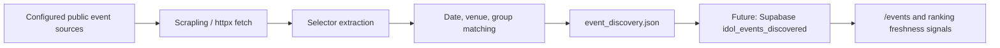

# Scrapling Event Crawler Design

## Goal

Use Scrapling as an adaptive crawler layer for public idol event pages. The first production-safe output is `frontend-next/public/data/event_discovery.json`, which can later be promoted into Supabase and merged with the existing Google Calendar event feed.

## Target Fields

| Field | Purpose |
| --- | --- |
| `title` | Event title or listing headline |
| `starts_at` / `ends_at` | Event start and end time in `Asia/Taipei` |
| `venue_name` / `venue_address` / `city` | Venue matching and location filtering |
| `group_names` / `member_names` | Links the event to existing idol-platform rankings |
| `ticket_url` / `detail_url` | User action and source verification |
| `source_id` / `source_url` / `raw_text` | Traceability and debugging |
| `confidence` | Guardrail before showing crawler results as official data |

## Data Flow

## Implementation

- `pipeline/event_sources.json` keeps source URLs and selectors outside code.
- `pipeline/event_crawler.py` uses Scrapling if installed, then falls back to `httpx`.
- `supabase/migrations/008_event_discovery.sql` defines the future normalized storage layer.
- The crawler is defensive: blocked pages or bad selectors produce zero records instead of breaking the daily pipeline.

## Promotion Rules

Crawler results should not be treated as official calendar data until they pass these checks:

- `confidence >= 0.7`
- `starts_at` exists
- `venue_name` exists
- At least one `group_names` match or a manually approved source-specific group mapping exists
- `detail_url` points back to the source page

## Next Practical Steps

1. Add 3-5 trusted Taiwan idol event listing sources to `event_sources.json`.
2. Tune each source selector with Scrapling shell or browser inspection.
3. Run `python pipeline/event_crawler.py` in GitHub Actions after `fetch_members.py`.
4. Upsert high-confidence rows into `idol_events_discovered`.
5. Merge approved discovered events into `/events` with a source badge.
